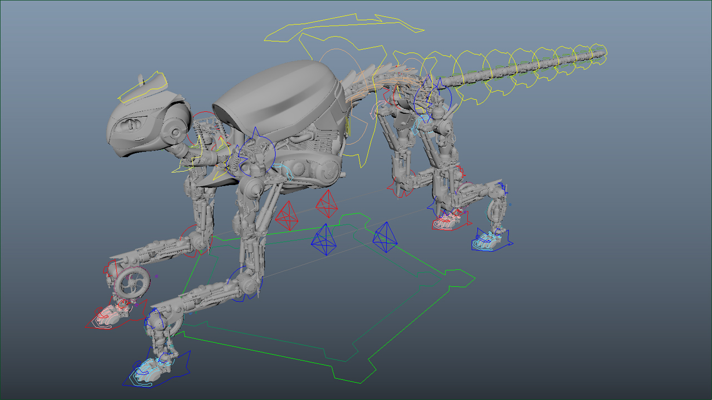

# mechCatRig

A rig of the mechanical cat model by Nico Strobbe. 

This rig is provided for educational and non-commercial purposes only. 
If used, please credit the modeler (Nico Strobbe) and rigger (Ryan Porter).

There are two rig files available.

mechCat_wip is the rig in a working state, with guides present but detached.
mechCat_ani is the rig in a published state, with the guides removed.

This rig is licensed under Creative Commons (CC BY-NC-SA 4.0)

This rig requires Maya 2016 or later.

Caveat animator. 
